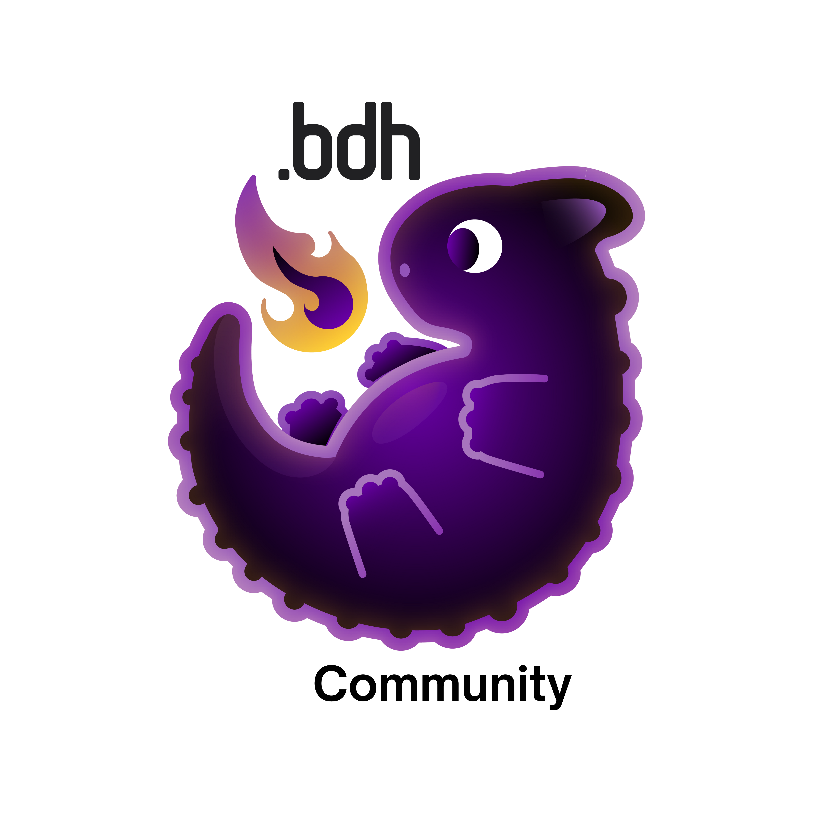

# burn_dragon_hatchling 🔥🐉🐣

burn inference and training of [dragon hatchling](https://arxiv.org/abs/2509.26507) model

## features

- [x] cached inference
- [x] training benchmarks and reporting
- [x] [eggroll training](https://arxiv.org/abs/2509.24372)
- [ ] int8 ES training (https://github.com/tracel-ai/burn/issues/464)
- [ ] adaptive tool discovery
- [ ] conditional (deep) gating
- [ ] document-coherent dataloading and scale mixup
- [ ] episodic memory
- [ ] fused kernels
- [ ] hierarchical, memory-aware recurrent state
- [ ] mixture-of-expert routing
- [ ] multi-modal architecture
- [ ] multi-stream truncated backpropagation through time
- [ ] neuromorphic backend
- [ ] rl reasoning training
- [ ] sparsity metrics and visualization
- [ ] streaming, sparse synaptic backpropagation
- [ ] temporal neuron dampening

Dataset configuration (built-in presets and Hugging Face examples) is documented inline in `config/base.toml`.

## training

- `cargo run --release` (defaults to the cuda backend)

## inference

- `cargo run --bin infer -- --max-tokens 2048 --streaming`

## benchmarks

- `cargo bench` (executes both wgpu and cuda benchmarks)
- open `target/criterion/report/index.html`

## compatible burn versions

| `burn_dragon_hatchling` | `burn` |
| :--                     | :--    |
| `0.2`                   | `0.19` |
| `0.1`                   | `0.18` |

## license
licensed under either of

 - Apache License, Version 2.0 (http://www.apache.org/licenses/LICENSE-2.0)
 - MIT license (http://opensource.org/licenses/MIT)

at your option.

## contribution

unless you explicitly state otherwise, any contribution intentionally submitted
for inclusion in the work by you, as defined in the Apache-2.0 license, shall be dual licensed as above, without any
additional terms or conditions.

